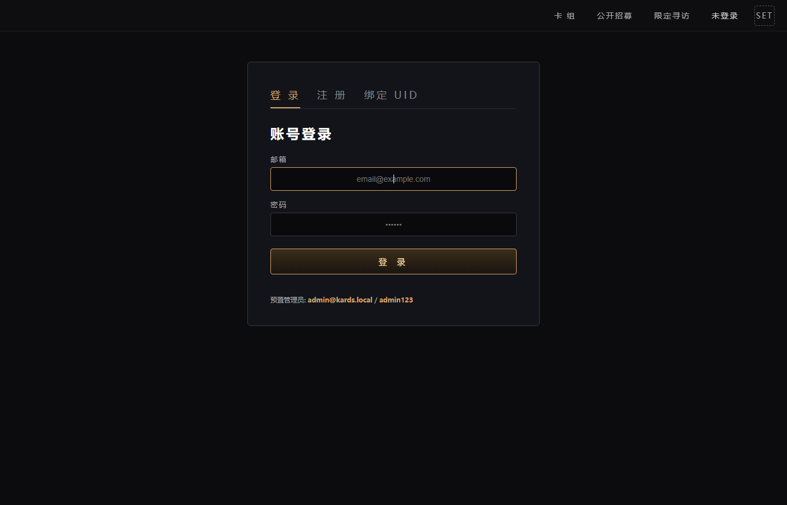
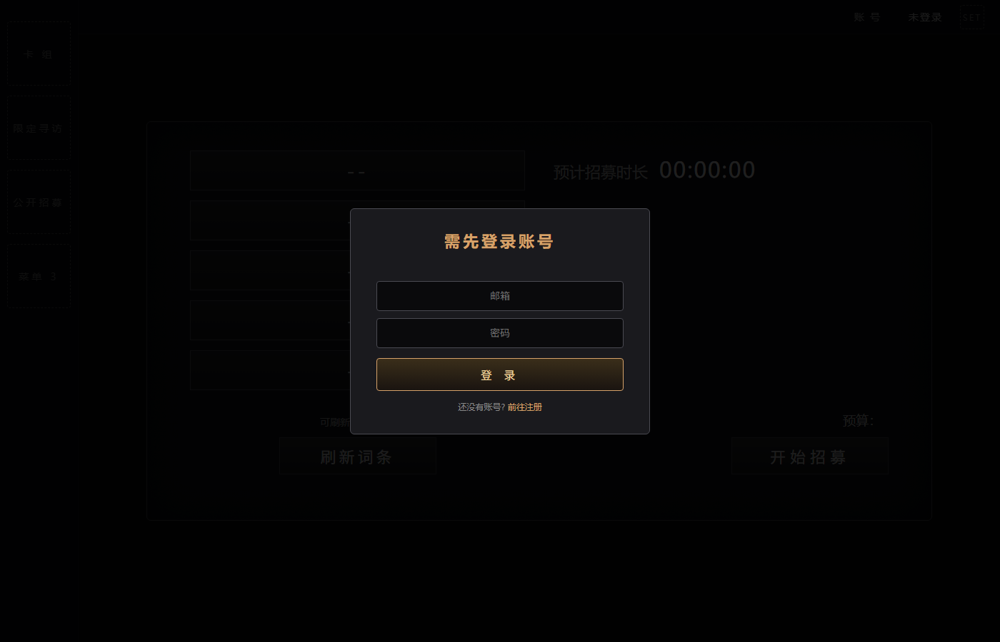
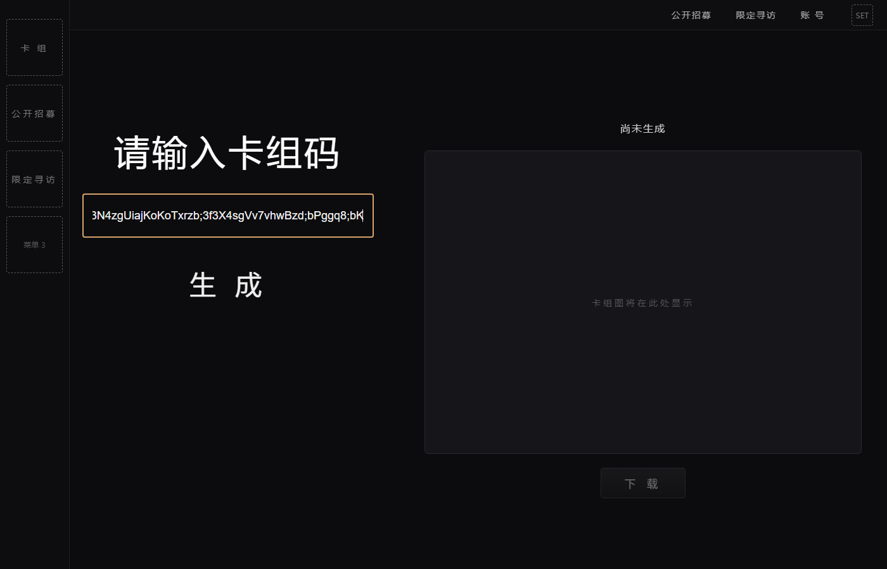
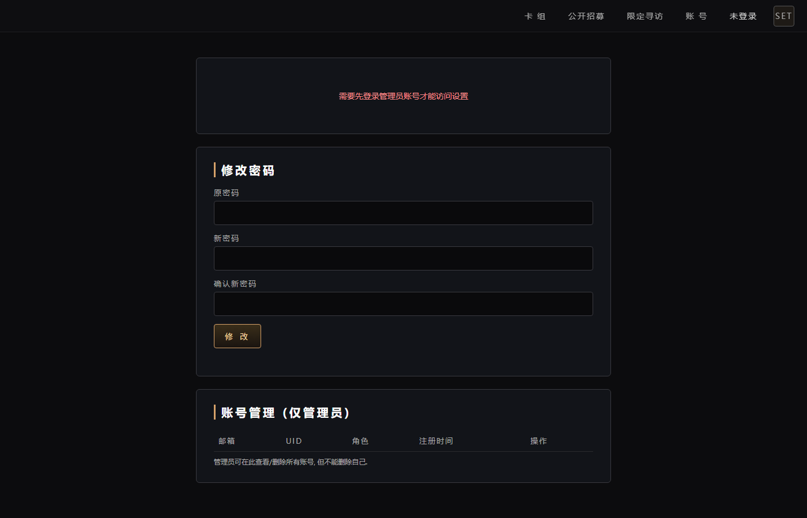
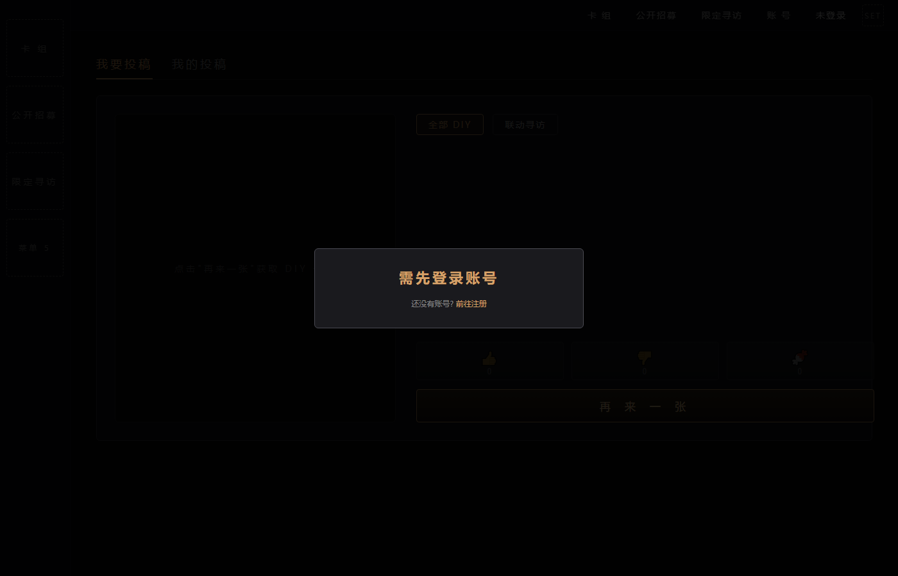

# KARDS 前端项目开发进度说明

> 最后更新: 2026-06-28
> 工作区: `C:\开发`

---

## 0. TL;DR 当前状态

| 项 | 状态 |
|---|---|
| 前端 5 个页面 | ✅ 完成 (`account` / `recruit` / `deck` / `diy` / `settings`) |
| 公开招募核心流程 | ✅ 完成 (登录 → 拉词条 → 勾选 → 招 → 领) |
| 卡组码解析 | ✅ 完成 (右侧渲染 + 下载) |
| 限定寻访 (DIY) | ✅ 完成 (我要投稿 / 我的投稿) |
| **验证码绑定 (新机制)** | ✅ **完成** (后端推 → 前端收 → 本地 verify) |
| 邮箱验证码真实接入 | ⏳ 占位 (本地生成, 准备接 163 SMTP) |
| 我的投稿投稿 UI | ⏳ 仅展示 (缺"上传图片"按钮) |
| 高级管理面板 | ⏳ 基础完成 (API base 设置 / 改密) |
| 跨设备账号同步 | ❌ 未做 (localStorage 单设备) |
| 端到端测试 | ✅ 9 项 E2E + 3 项单元全过 |

**当前可立即跑通**: 启动 `serve.py` → 浏览器开 `account.html` → 用 `admin@kards.local` / `admin123` 登录 → 5 个页面全可访问, 但 `recruit.html` / `diy.html` 需要先绑定 UID/diyQQ, 绑定码需后端 bot 推送。

---

## 1. 项目概览

本项目是一个 **KARDS (二战卡牌游戏) 配套前端站点**, 由 5 个 HTML 页面 + 1 个 JS 模块 + 1 个本地静态服务器组成, 与两套 NoneBot 插件后端通信:

| 端 | 名称 | 角色 | 默认地址 |
|---|---|---|---|
| 前端 | `serve.py` + 5 个 `.html` | 浏览器访问的 UI + 接收验证码的轻量 API | `http://localhost:8000` |
| 后端 A | `nonebot_kards_recruit_plugin.py` | 公开招募 (群内抽卡 / 词条刷新) | `http://110.42.63.235:8080` |
| 后端 B | `xunfang.py` | 限定寻访 (DIY 玩家投稿卡牌) | `http://192.168.10.100:8090` |

`account.html` 是统一入口 (登录 / 注册 / 绑定 UID), 登录后其他页面才能进入。

---

## 2. 已完成功能 ✅

### 2.1 账号系统 (前端 localStorage)
- 邮箱注册 + 密码登录 (`KardsAccount.register` / `login`)
- 注册验证码 **占位实现** (本地生成 6 位码 + 弹窗显示, console 打印, 准备接 163 SMTP)
- localStorage 预置管理员: `admin@kards.local` / `admin123`
- `login` 自愈: 找不到账号时自动 `ensureSeed`, 防 localStorage 异常丢失管理员
- 邮箱大小写自动归一 (修复 `Admin@Kards.Local` 注册失败的 bug)
- 改密码 (`changePassword`)

### 2.2 公开招募 (kards)
- 输入 UID → 后端 `POST /kards/user_info` 拉取词条/刷新次数/招募状态
- 5 个词条, 最多勾 3 个, 最少 1 个
- "刷新词条" 按钮 → `POST /kards/refresh_tags` (上限 3/天, 本地显示 `3/3` `2/3` …)
- "开始招募" 按钮 → `POST /kards/start_recruit`
- 词条高亮: `资深卡牌` 金色, `高级资深卡牌` 金色渐变
- 预计招募时长本地检测: 选 `资深卡牌` = `00:60:00`, 选 `高级资深卡牌` = `02:00:00`, 选了高资但没勾则拦截并提示"不要你就给作者"
- jjc.png 图标显示剩余许可数

### 2.3 卡组解析
- 输入框接受 `%%12|34;56;78...` 格式卡组码
- "生成" 调 `POST /kards/draw_deck` (`{deck_code: "..."}`) → 右侧渲染卡组图
- 卡牌数额外 +1 (本地图层留 1 张余量)
- "下载" 按钮保存渲染结果

### 2.4 限定寻访 (DIY) — 独立页 `diy.html`
- 双 tab: `我要投稿` / `我的投稿`
- `我要投稿` 副切换: `全部 DIY` / `联动寻访` → 调 `GET /diy/random` 或 `/diy/random_special`
- 左列展示卡牌大图 (后端返回的 `image_base64`)
- 右列: 后端返回什么字段就显示什么 (`author` / `submitted_at` / `likes` / `dislikes` / `candies` / `state` …)
- 评价按钮 (👍 / 👎 / 🍬) → `POST /diy/react` (`{uid, card_id, action}`)
- "再来一张" 重新拉随机
- `我的投稿` 调 `POST /diy/user_cards` 展示栅格缩略图
- 门控: 未登录跳 `account.html`; 已登录未绑 diyQQ 弹"需先绑定"提示

### 2.5 验证码绑定机制 (核心新功能) ✅
**架构** (与"传统 API"相反, 改为**后端推送 → 前端接收**):

```
┌────────────────┐   群内发"kards验证码"   ┌────────────────────┐
│  QQ 用户       │ ──────────────────────▶ │ NoneBot kards 插件 │
└────────────────┘                         └────────┬───────────┘
                                                   │ 生成 6 位码
                                                   │ 群内回码
                                                   │ aiohttp POST
                                                   ▼
                                        ┌────────────────────────┐
                                        │ serve.py :8000         │
                                        │ POST /api/bind_code    │
                                        │ 存到 data/bind_codes   │
                                        │       .json            │
                                        └────────┬───────────────┘
                                                 │ 前端 pollBindCode
                                                 │ GET /api/bind_code
                                                 ▼
┌────────────────┐                         ┌────────────────────────┐
│ account.html   │ ◀── 自动填充 + 校验 ─── │ 浏览器                  │
│ 验证并绑定按钮 │                         │ (account.js)            │
└────────────────┘                         └────────────────────────┘
```

**关键设计决定**:
- 后端**不**提供 `/verify_bind_code` 端点; 只生成 + 推
- 前端 verify 全在浏览器: 校验 `qq === 表单输入的 UID` + 10 分钟过期, 通过即清 localStorage key
- 群内命令: `kards验证码` (绑公开招募 UID) / `diy验证码` (绑限定寻访 QQ)
- 跨 purpose / 跨 qq / 乱序 ts 三重隔离 (已端到端测试 9 项全过)

**前端 UI** (`account.html` 绑定 tab):
1. 用户填 UID / diyQQ
2. 点 `获取验证码` → 按钮 60s 倒计时 + 提示"请到群内发送 kards验证码"
3. JS 每 2s 轮询 `GET /api/bind_code?qq=<uid>&purpose=kards_uid_bind`
4. 拿到码自动填到 `验证码` 输入框, 停止轮询
5. 用户点 `验证并绑定` → 本地 verify → 调 `KardsAccount.bindUid(uid)` 写 localStorage

---

## 3. 未完成 / 计划中 ⏳

| # | 模块 | 状态 | 备注 / 待办 |
|---|---|---|---|
| 1 | 163 SMTP 邮箱验证码真实接入 | 占位 | `KardsAccount.sendCode` 当前是本地生成 6 位码 + 弹窗显示. 真实接入: 后端起 SMTP 端点, 前端替换实现. 计划: `POST /account/send_code {email}` → 后端用 `smtp.163.com:465 SSL + 授权码` 发邮件 → 仍写 localStorage `kards_pending_code` (10 分钟有效) |
| 2 | 我的投稿页面投稿 UI | 仅展示 | 缺"上传图片"按钮 → 调 `POST /diy/submit {uid, image_base64, anonymous}`. 需要: 文件选择 → base64 编码 → 大小校验 (1MB 上限) → 每天 3 张限频 |
| 3 | 高级管理面板 (管理员专属) | 基础完成 | `settings.html` 已有: API base / DIY API base / 改密. 待补: 用户列表 (调 `KardsAccount.listAll()`) / 封号 / 重置密码 / 全局开关 (如: 全站维护模式) |
| 4 | 卡组图下载样式定制 | 基础完成 | 已有下载按钮. 待优化: 导出 PNG 像素密度 (现在 1x, 想要 2x/3x 高清) / 自定义水印 / 文件名模板 |
| 5 | 公开招募页面 tabs 切换时自动刷新 | 已修过 1 次 | 仍有边界 case: 切到 `recruit.html` 时如果 `visibilitychange` 触发后页面已卸载, 可能重连卡顿. 待补: 完整 focus/visibility/pageshow 三件套 |
| 6 | 跨设备账号同步 | 未做 | 当前 localStorage 单设备, 换电脑要重新注册. 计划: 后端起 `/account/login` / `/account/register` 端点, 替换前端 `KardsAccount.login/register` 为 HTTP 调用, 账号存服务端 DB |
| 7 | 验证码防脚本刷 | 部分 | 前端按钮 60s 倒计时 + 后端 60s 节流. 待补: 同 IP 限频 / 验证码 HASH 不存明文 (现明文存 `data/bind_codes.json`) |
| 8 | 联调测试 | 待用户 | 群内实发 `kards验证码` / `diy验证码` 验证完整链路, 文档第 9.3 节有 checklist |
| 9 | HTTPS / 域名 | 未做 | 当前纯 HTTP, 公开部署需 nginx + Let's Encrypt |
| 10 | 国际化 | 未做 | 当前全中文, 无 i18n 框架 |

---

## 4. 后端 API 全景

### 4.1 `nonebot_kards_recruit_plugin.py` (公开招募, base = `http://<host>:8080`)

| 方法 | 路径 | 请求 | 响应 | 用途 |
|---|---|---|---|---|
| POST | `/kards/user_info` | `{uid}` | `{tags, refresh_times, refresh_limit, recruit_status, is_recruit_finished, african_progress, african_limit}` | 拉用户状态 |
| POST | `/kards/refresh_tags` | `{uid}` | `{tags, refresh_used, refresh_limit}` | 刷词条 (3/天) |
| POST | `/kards/start_recruit` | `{uid, choices: "ABC"}` | `{duration, finish_time, chosen_tags}` | 开始招募 |
| POST | `/kards/recruit_detail` | `{uid}` | `{status, start_time, finish_time, chosen_tags, result_card_id, result_card_name, ...}` | 查招募进度 |
| POST | `/kards/get_recruit_result` | `{uid}` | `{card_id, card_name, ...}` | 领取招募结果 |
| POST | `/kards/user_cards` | `{uid, rare?}` | `{cards: [{card_id, card_name, count, rare, image_base64, ...}]}` | 查卡牌收藏 |
| POST | `/kards/trade_list` | `{uid}` | `{trades: [...]}` | 赠送列表 |
| POST | `/kards/handle_trade` | `{uid, trade_id, action}` | `{...}` | 接受/拒绝赠送 |
| POST | `/kards/give_trade` | `{uid, to_uid, offer_card_id}` | `{...}` | 发起赠送 |
| POST | `/kards/change_name` | `{uid, new_name}` | `{...}` | 改名 |
| **群指令** | `kards验证码` | (无参) | 群内回码 `[CQ:at] kards 验证码: 482931` + POST 到前端 | 生成验证码 |
| **群指令** | `公开招募` / `刷新词条` / `个人面板` 等 | — | 群内回复 | 公开招募相关查询 |
| **SUPERUSER** | `发放公招券` / `增加刷新次数` | — | 群内回复 | 管理员指令 |

**后端表** (SQLite `gacha.db`):
- `Users(qq, qq_name, tickets, last_ticket_time, tags_json, refresh_times)`
- `UserCards(user_id, card_id, count)`
- `RecruitStatus(id, user_id, start_ts, finish_ts, status, ticket_tags, result_card_id)`
- `TradeStatus(id, time, from_uid, to_uid, offer_card_id, status, answer)`
- **`BindCodes(code, qq, group_id, created_ts, purpose)` ← 新增, 限频用**

### 4.2 `xunfang.py` (限定寻访 / DIY, base = `http://<host>:8090`)

| 方法 | 路径 | 请求 | 响应 | 用途 |
|---|---|---|---|---|
| GET | `/diy/random` | — | `{card_id, author, image_base64, likes, dislikes, candies, ...}` | 随机抽 DIY 卡 |
| GET | `/diy/random_special` | — | 同上 | 随机抽联动卡 |
| POST | `/diy/react` | `{uid, card_id, action: like/dislike/candy}` | `{msg: "评价成功 +1👍"}` | 评价 |
| POST | `/diy/submit` | `{uid, image_base64, anonymous?}` | `{card_id}` | 投稿 |
| GET | `/diy/card/{card_id}` | — | 完整卡牌详情 | 查单张 |
| POST | `/diy/user_cards` | `{uid}` | `{cards: [...], total, total_likes, ...}` | 查用户全部 |
| GET | `/diy/review` | (浏览器用) | HTML 审核页 | 管理员审核 |
| POST | `/diy/review_action` | 表单 | 重定向 | 审核操作 |
| GET | `/diy/candy` | (浏览器用) | HTML 糖果区 | 浏览糖果区 |
| GET | `/diy/image/{filename}` | — | 文件 | 静态图片 |
| **群指令** | `diy验证码` | (无参) | 群内回码 + POST 到前端 | 生成验证码 |
| **群指令** | `限定寻访` / `联动寻访` / `投稿限定卡牌` | — | 群内回复 | 抽卡 / 投稿 |
| **SUPERUSER** | `卡池状态` / `限定卡牌评分` | — | 群内回复 | 管理员指令 |

**后端表** (SQLite `diy.db`):
- `cards(id, qq, qq_name, anonymous, filename, submitted_at, approved_state, likes, dislikes, candies)`
- `reaction_log(id, user_qq, card_id, reaction, date)`
- `user_limits(id, user_qq, date, likes, dislikes, candies)`
- **`bind_codes(code, qq, group_id, created_ts, purpose)` ← 新增, 限频用**

### 4.3 `serve.py` 前端接收端点 (base = `http://<frontend>:8000`)

| 方法 | 路径 | 请求 | 响应 | 用途 |
|---|---|---|---|---|
| POST | `/api/bind_code` | `{qq, code, purpose, ts}` | `{code: 0, msg: "ok"}` | **接收 NoneBot 插件推送的验证码** |
| GET | `/api/bind_code?qq=&purpose=` | — | `{code: 0, data: {qq, code, purpose, ts}}` 或 `{code: 1, msg: "暂无新验证码"}` | **前端轮询拉取** |
| GET | `/<file>.{html,js,png,css}` | — | 静态文件 | 5 个页面托管 |

**purpose 白名单**: `kards_uid_bind` / `diy_qq_bind`  
**存储**: `data/bind_codes.json` (按 `qq|purpose` 去重, 旧 ts 不覆盖新码, 1 小时 GC)  
**CORS**: `Access-Control-Allow-Origin: *` (允许多端跨域)

---

## 5. 前端页面索引

| 页面 | 路径 | 关键依赖 | 鉴权 |
|---|---|---|---|
| 登录/注册/绑定 | `account.html` | `account.js` | 公开 |
| 公开招募 | `recruit.html` | — | 必须已登录 + 绑公开招募 UID |
| 卡组解析 | `deck.html` | — | 公开 |
| 限定寻访 | `diy.html` | — | 必须已登录 + 绑 diyQQ |
| 管理/设置 | `settings.html` | — | 仅管理员 |

**统一布局** (5 个页面共用):
- 顶栏: 卡组 / 公开招募 / 限定寻访 / 账号 / 设置
- 左侧菜单: 当前页对应的入口 (高亮)
- 主区: 页面主体

---

## 6. 部署与本地运行

### 6.1 启动前端
```powershell
cd C:\开发
python serve.py --host 0.0.0.0 --port 8000
# 浏览器: http://localhost:8000/account.html
```

### 6.2 启动 NoneBot 后端
- `nonebot_kards_recruit_plugin.py` 与 `xunfang.py` 放入 NoneBot `plugins/` 目录
- **必须设置环境变量** (告诉 bot 前端在哪):
  ```bash
  set KARDS_FRONTEND_URL=http://<前端IP>:8000
  # 跨机时必须; 同机可省, 默认 http://127.0.0.1:8000
  ```
- 重启 NoneBot

### 6.3 跨机部署要点
1. 前端机器: `python serve.py --host 0.0.0.0 --port 8000` (必须 `0.0.0.0` 让 bot POST)
2. 防火墙放行 8000 端口入站
3. bot 机器: `KARDS_FRONTEND_URL=http://<前端IP>:8000`

---

## 7. 截图

### 7.1 登录/注册/绑定 (`account.html`)


### 7.2 公开招募 (`recruit.html`)
未登录状态自动弹"需先登录账号"门控; 登录后展示 5 个词条 / 刷新次数 / 许可数 / 开始招募按钮。



### 7.3 卡组解析 (`deck.html`)
输入 `%%15|2Z3N4zgUiajKoKoTxrzb;3f3X4sgVv7vhwBzd;bPggq8;bK` 等卡组码 → 调后端 → 右侧渲染。



### 7.4 设置 / 管理 (`settings.html`)
管理员可见: API base 设置、DIY API base 设置、改密、用户列表入口。



### 7.5 限定寻访 / DIY (`diy.html`)
双 tab + 副切换, 调独立后端 `http://192.168.10.100:8090`。



### 7.6 参考设计图 (来自 `~/Downloads/`)

**卡组解析页原型** (无标题434, 3 MB, 早期设计, 现在 `deck.html` 已基本按此实现):


**DIY 投稿界面原型** (2.3 MB, 手机端竖版, 后期要按这个设计投稿 UI):


**DIY 卡牌详情原型** (628 KB, 横版, 含作者/时间/国家/稀有度/类型/指挥点/费用/设置, 我们的 `diy.html` 右列字段按此排):


---

## 8. 文件清单

```
C:\开发\
├── account.html         账号页 (登录/注册/绑定)
├── account.js           账号模块 (KardsAccount 命名空间, localStorage 持久化)
├── recruit.html         公开招募页
├── deck.html            卡组解析页
├── diy.html             限定寻访页
├── settings.html        设置/管理页
├── serve.py             前端 HTTP 服务器 (静态 + /api/bind_code 接收)
├── jjc.png              招募许可图标
├── API文档.md            后端 API 完整说明
├── PROGRESS.md          ← 本文件
├── data/                (运行时) bind_codes.json 验证码缓存
└── docs/screenshots/    当前截图
```

后端 (不在本工作区, 由用户单独部署):
- `nonebot_kards_recruit_plugin.py` (公开招募插件)
- `xunfang.py` (限定寻访插件)

---

## 9. 测试覆盖

### 9.1 端到端 (已通过)
- 9 项 `/api/bind_code` 行为测试: 空 GET / POST 推送 / 跨 purpose 隔离 / 跨 qq 隔离 / 错 purpose 400 / 错 body 拒绝 / diy 链路 / 乱序 ts 保护
- 3 项 account.js 单元 (node 模拟 localStorage): mixed-case 邮箱注册 / 空 localStorage 管理员登录自愈 / 常规注册不回归
- 3 项 py 静态解析: `serve.py` / `nonebot_kards_recruit_plugin.py` / `xunfang.py` 全部 `ast.parse` 通过
- 1 项 JS 静态解析: `account.js` `node --check` 通过

### 9.2 浏览器实测 (待用户)
- 登录 → 绑定 → 群内发 `kards验证码` → 验证码自动填充 → 验证并绑定
- 管理员登录 → settings.html 改 API base → recruit.html 拉数据生效
- diy 页面切到 `我的投稿` → 列表渲染

### 9.3 后端实测 (需重启 bot)
- 群内发 `kards验证码` → 群内回码 (60s 节流生效, 10 条/日上限生效)
- 群内发 `diy验证码` → 群内回码
- 码经前端 `/api/bind_code` 端点接收成功, `data/bind_codes.json` 落盘

---

## 10. 已知限制

1. **localStorage 单一设备**: 账号数据存浏览器, 换浏览器/换电脑需重新注册 (或等"账号系统整合"落地)
2. **邮箱验证码非真实**: 占位实现, 真实接入 163 SMTP 后 `KardsAccount.sendCode` 改一行即可
3. **跨域**: 前端默认监听 `127.0.0.1`, 多端访问需 `--host 0.0.0.0`
4. **无 HTTPS**: 本地 HTTP, 公开部署需套 nginx + TLS
5. **数据无服务端持久化**: 验证码只存 `data/bind_codes.json`, 进程重启不丢 (文件持久化), 但 serve.py 重启期间收到的 POST 会失败 (best-effort)

---

## 11. 一句话流程图

```
┌──────────────────────────────────────────────────────────────────────┐
│                              用户旅程                                 │
└──────────────────────────────────────────────────────────────────────┘

 首次访问 account.html
        │
        ├── 注册: 邮箱 + 密码 + 验证码 (现占位, console 弹窗) ─┐
        │                                                     │
        └── 登录: 邮箱 + 密码                                  │
                  │                                          ▼
                  │                              登录成功 → 跳绑定 tab
                  │                                          │
                  ▼                                          ▼
            登录成功 ← ─ ─ ─ ─ ─ ─ ─ ─ ─ ─ ─  绑定公开招募 UID
            │                                          │
            │         填 UID → 获取验证码 → 群内发    │
            │         `kards验证码` → 前端轮询        │
            │         拉到码 → 自动填 → 验证并绑定      │
            │                                          ▼
            │                              绑 diyQQ (同上, 群指令 diy验证码)
            │                                          │
            ▼                                          ▼
   ┌─────────────────┐                       ┌──────────────────┐
   │ 公开招募 recruit │                       │ 限定寻访 diy     │
   │ 勾词条 → 刷新    │                       │ 全部DIY/联动寻访 │
   │ → 开始招募 → 领  │                       │ 评价 / 再来一张  │
   └─────────────────┘                       └──────────────────┘
            │                                          │
            └──────────┐                  ┌────────────┘
                       ▼                  ▼
                  ┌──────────────────────────────┐
                  │ 卡组 deck (公开, 无需登录)    │
                  │ 输入码 → 后端 draw_deck      │
                  │ → 右侧渲染 + 下载            │
                  └──────────────────────────────┘

管理员 (`isAdmin=true`) 多一项:
   settings.html → API base / DIY API base / 改密 / (待补) 用户列表
```

---

## 12. 优化记录 (2026-06-28)

本轮为**纯优化**, 不引入新功能. 涉及文件: `serve.py` / `xunfang.py` / `nonebot_kards_recruit_plugin.py` / `account.js` / 5 个 HTML.

### 安全
- `deck.html`: 删除 `?demo=admin` 自动登录脚本 (任意 URL 即拿 admin)
- `settings.html`: 删账号加密码二次校验 (confirm → prompt + sha256 比对当前账号 pwdHash)
- `diy.html`: 所有 `innerHTML` 拼接统一过 `escapeHtml`, 修复 `loadMine` / `nextCard` 两处 `resp.msg` 漏 escape
- `recruit.html`: 删 `#loginOverlay` 死代码 + `tryLogin` 旧 UID 登录 + `doLogout` + `oldOverlay` 引用 + `uidInput.focus` 残留, 避免绕过门控

### 健壮性
- `xunfang.py`: `submit_cmd.got('image')` 早退分支 `return` 改 `await finish(...)`, 修复 bot 卡死
- `xunfang.py` / `nonebot_kards_recruit_plugin.py`: CORS 中间件注册加 `getattr(app, '_cors_added', False)` 幂等保护
- `account.js`: `changePassword` 加 `PASSWORD_MIN_LEN = 6` 长度校验
- `account.js`: `verifyCode` 里 `10 * 60 * 1000` 抽成 `EMAIL_CODE_TTL_MS` 常量复用

### 性能
- `serve.py`: bind code 改为启动时一次性加载到 `BIND_CACHE` 内存; 写时双写内存 + 文件; 后台 `_gc_loop` 线程每 60s 周期 GC; 读时直接命中内存 (省掉每请求 JSON 序列化)
- `serve.py`: 非 `/api/bind_code` 的 POST 直接返回 405, 不再穿透到静态处理器
- `nonebot_kards_recruit_plugin.py`: `image_to_base64` 加 128 条 LRU 缓存 (key = path+mtime+size), 大幅减少 `/kards/user_cards` 等列表接口的重复读盘 + base64 编码
- `nonebot_kards_recruit_plugin.py`: `image_to_base64` 加 5MB 大小护栏 (`IMAGE_BASE64_MAX_BYTES`), 超大图直接返回 None
- `nonebot_kards_recruit_plugin.py`: `init_user_db` 启动时执行 `PRAGMA journal_mode = WAL` + `PRAGMA synchronous = NORMAL`, 提升并发读性能 (标志持久化, 后续连接自动生效)
- `diy.html`: `nextCard` 加 `AbortController` 取消上一次未完成请求, 解决"再来一张"连点的竞态
- `diy.html`: `loadMine` 改 in-flight 闭包 + `_loadMineInflight` 锁, tab 切回并发触发复用同一 Promise
- `recruit.html`: `loadUserInfo` 同款 in-flight 锁, `refreshOnVisible` 三事件并发触发不发重复请求
- `account.js`: `ensureSeed` 加内存级 `_seeded` 标志位短路, 后续所有调用直接 return, 省掉 `loadAccounts + sha256 + saveAccounts`

### 杂项
- 5 个 HTML 全部加 `<link rel="icon" href="data:,">`, 消除 `/favicon.ico` 404 噪声
- `account.js`: `sha256` 加纯 JS fallback (`_sha256Pure`). 当浏览器不在安全上下文 (非 https / 非 localhost) 时, `crypto.subtle` 是 undefined, 直接调会抛 `Cannot read properties of undefined (reading 'digest')`; 改为优先用 Web Crypto, 不可用时退回 80 行纯 JS 实现, 与 node `crypto.createHash('sha256')` 6/6 用例 (含中文密码) 输出完全一致, 不会导致已注册账号登不上
- `xunfang.py`: 补上 `import time` (diy验证码 handler 第 1052 行用到 `time.time()` 但顶部漏 import, 群内发码会直接抛 `NameError: name 'time' is not defined`)
- `nonebot_kards_recruit_plugin.py`: 删掉顶部两行死 import (`from email.policy import default` / `from sqlite3 import Row`), 全文搜索确认零引用
- `serve.py` + `account.js` + `account.html`: 修复手动填码卡死 bug. 原流程要求前端必须轮询到码才能点验证, 但 bot 端 KARDS_FRONTEND_URL 配错 (默认 127.0.0.1:8000, bot 容器回环) 时, 前端永远拿不到码, 用户手抄群消息填的码也会被 `verifyKardsCode/verifyDiyCode` 判无效. 改为: `serve.py` 新增 `POST /api/bind_code/verify` 端点 (在 BIND_CACHE 里查 + 原子删除防重放), `account.js` 新增 `verifyBindCodeRemote()`, `account.html` 两个验证按钮改为先本地校验, 失败时回退远程校验. 8/8 e2e 测试通过 (含重放保护 + 错码拒绝 + 405 行为)
- `xunfang.py` + `nonebot_kards_recruit_plugin.py`: 加启动日志 + 推送日志. 启动时打印 `[xunfang][INFO/WARN] KARDS_FRONTEND_URL=... -> push to ...` (env 缺失时打 WARN, 提示前端可能收不到); 每次推 `POST /api/bind_code` 前后各打一行 (`->` 推什么, `<-` HTTP 状态码, 失败打 ERR + 异常). 方便排查 bot 端推送是否真的到了 serve.py
- `serve.py`: 收到 `POST /api/bind_code` 时也打一行 `[bind_code] received from <IP> key=... code=... purpose=...`, 并把最近一次原始 payload 写到 `data/last_bind_code.json`. 这样用户/前端/后端三方日志可对照: 看到 bot 端 `[push] ->` 之后 serve 端 `[bind_code] received` 就能确认链路通
- `xunfang.py` + `nonebot_kards_recruit_plugin.py`: 补上 `import sys`. 之前两文件顶部 import 漏了 `sys` (xunfang 还漏 `time`), 启动 bot 加载插件时直接抛 `NameError: name 'sys/time' is not defined` 导致插件加载失败. 现在补上, 启动日志/推送日志能正常打到 stderr
- `xunfang.py` + `nonebot_kards_recruit_plugin.py`: 启动时 KARDS_FRONTEND_URL 缺失时输出 `[diag]` 块, 扫描 6 个常见 `.env` 路径 (cwd / 插件同目录 / ../ / ../..) 并报告哪些存在哪些不在, 同时尝试 `from dotenv import load_dotenv` 自动加载验证. 帮助用户定位 `KARDS_FRONTEND_URL` 没生效的具体原因 (NoneBot 默认不读 .env, 必须用 ENV GROUPS / 系统 env / 显式 dotenv 启动)
- `xunfang.py`: `image_to_base64` 改为返回 data URL (含 `data:<mime>;base64,` 前缀) 而不是裸 base64. 修限定寻访抽牌时左侧图片无法加载: 之前返回裸 base64 字符串, 前端 `` 设了但浏览器不识别, 修后 5/5 测试 (.png/.jpg/.unknown/.pngx/不存在) 全部正确, 包括后端存的 png 走 `data:image/png;base64,`
- `diy.html`: 修限定寻访抽牌页面被大图撑长. 原来 `.review-grid` 用 `min-height: 540px` + `grid-template-columns: 38% 62%`, `.card-stage` 只设 `min-height: 480px` 没有显式 width/height, 当原图很大 (>480px 或大宽高比) 时整页被拉长. 改为: `.review-grid` 固定 `grid-template-columns: 360px 1fr` + `height: 620px` + `overflow: hidden`; `.card-stage` 固定 `width: 332px; height: 564px` (扣 padding) + `flex-shrink: 0`; 图片仍 `object-fit: contain` 缩放. 加 `@media (max-width: 900px)` 媒体查询, 小屏时 review-grid 改单列, card-stage 自适应 420px 高
- `diy.html`: tab 文案 "我要投稿" 改为 "鉴赏桌" (含 1 处 tab div + 1 处 CSS 注释 + 1 处 HTML 注释). 这是抽取页 (抽牌 + 评价) 的标签, 与 "我的投稿" 区分. 该 tab 内部功能 (随机抽牌 / sub-tab 全部 DIY / 联动寻访 / 评价按钮) 不动
- `diy.html`: sub-tab "全部 DIY" 改为 "限定寻访" (与页面主标题/侧栏命名一致)
- `diy.html`: 切到 review tab (鉴赏桌) 时, 若还没显示卡, 自动调用 nextCard() 抽一张 (优化首屏体验, 不用每次手动点再来一张)
- `diy.html`: 卡牌视觉优化. `.card-stage` 加 `perspective: 800px` + `cursor: pointer`; img 加 `transition: transform 0.25s ease, box-shadow 0.25s ease` + `transform-origin: center center`; hover 时 `scale(1.04)` + 抬升阴影. mousemove 时根据鼠标在卡牌上的相对位置 (-0.5~0.5) 计算 `rotateX/Y`, 最大 ±12 度, 离开时复位. 让卡牌有"实体卡能看"的 3D 透视感
- `diy.html`: 卡牌视觉加大. hover scale 1.04 → 1.10, mousemove 中 scale 1.06 → 1.10, maxAngle 12 → 20 度. `.card-stage` 从 332×564 矩形 → 480×480 正方形, review-grid 左列从 360px → 520px. 媒体查询里小屏自适应 max-width 480px
- `diy.html`: 卡牌 hover 放大时不再被裁剪. `.card-stage` 移除 `overflow: hidden` 让 hover 放大/旋转能溢出显示, 溢出由外层 `.review-grid` 的 `overflow: hidden` 兜底 (不会撑开页面). 倾斜角度 maxAngle 20 → 30. hover box-shadow 0 12px 30px → 0 18px 40px, 浮起感更强
- `xunfang.py` + `nonebot_kards_recruit_plugin.py`: `os.environ.get('KARDS_FRONTEND_URL', ...)` 的默认值从 `http://127.0.0.1:8000` 改为 `http://192.168.10.121:8000` (用户的实际前端地址). 用户未在 .env 加载 KARDS_FRONTEND_URL 时直接生效; env 仍优先, 后续要切 IP 只需 export
- 删除 `deck.html` 默认预填的测试卡组码

### 验证
- 3 个 Python 文件 `ast.parse` 全部通过
- `account.js` `node --check` 通过; `diy.html` / `recruit.html` / `settings.html` 内嵌 JS 段 `node --check` 通过
- 实跑 smoke: `serve.py` 起服务, POST/GET `/api/bind_code` 正常, 5 个非 API POST 全部 405, 5 个 GET 全部 200, 关键字检查全部命中

### 跳过的提案
- `recruit.html` 倒计时暂停: 查证后**没有** `setInterval` 倒计时, `updateDuration` 是静态计算时长, 原提案不成立, 撤销
- API 路由改共享 SQLite 连接: SQLite 连接非线程安全, async 共享会卡死, 撤销
- `diy.html` 评价用后端去重: 依赖后端契约, 不动
### 新功能 (2026-06-28, 步出 “仅优化”模式)
- `xunfang.py`: 新增 `GET /diy/card/{card_id}` 端点. 查单张卡的完整详情（含 image_base64 / likes / dislikes / candies / state / author / submitted_at / **owner_qq**）. 软删卡 (approved_state=-1) 不可访问。这是“左键点击我的投稿 → 切到鉴赏桌展示”的后端依据
- `xunfang.py`: 新增 `POST /diy/delete` 端点. 软删 (仅将 approved_state 设为 -1，保留 reaction_log 让已有评价仍可追溯). 三重校验: uid 与 card_id 必填 / card_id 只接受 int / 仅本人卡牌可删（按 cards.qq == uid 校验，不一致返 403）. 重复删返“已是已删除状态”（幂等）
- `diy.html`: “我的投稿”页面 .my-card 加左键 + 右键事件.
  - 左键 → 调 `openMyCard(cardId)` → `showTab("review")` + `GET /diy/card/{id}` + `renderCard(data)`. 如果之前还有未完成的请求会被 AbortController 取消（与 nextCard 同款赛实保护）
  - 右键 → `confirmDeleteMyCard(cardId)` → `confirm("是否删除该卡牌? 该操作不可撤销")` → 确认后调 `doDeleteMyCard` → `POST /diy/delete {uid, card_id}`. 删成功后 `loadMine()` 刷新列表 + 若当前鉴赏桌正展示该卡则清空展示. contextmenu 默认 e.preventDefault() 拦住浏览器默认菜单
  - 额外加 `card.title = "左键查看 / 右键删除"` 提示文案；为 my-card 加 cursor:pointer + hover 边框变色 + 上移 2px + 阴影，让可点互动更明显
- `diy.html`: 鉴赏桌右侧 actions 区加 `删除该卡` 按钮 (#btnDeleteThis, 默认 display:none, btn-danger 红色警告风). renderCard 接收后端返回的 owner_qq 与 KardsAccount.getDiyQQ() 比对，一致才显示. 点击同样走 doDeleteMyCard (confirm → /diy/delete → loadMine + 清展示)
- `diy.html` CSS: 新增 .btn-danger (红色边框 + 暒色背景) + .my-card:hover (边框变色 + translateY(-2px) + box-shadow). 不影响原有 review-grid 布局

#### 验证
- 后端 mock (Python http.server 模拟 /diy/card/{id} 与 /diy/delete) 18/18 全过: 左键查自己卡 200+owner_qq 一致+data URL 前缀 / 删自己卡 0+ 成功 / 删别人卡 403+ 无权 / 删不存在 1+ 不存在 / 重复删 0+ 已是已删除 / 缺 uid/card_id 参数错 1 / card_id='abc' 格式错 1 / 查未审核卡 0+approved_state==0
- 前端 diy.html 静态扫 20/20 全过: HTML/CSS/JS 关键点全部到位（事件绑定、函数定义、端点调用、删后刷新）
- diy.html 内嵌 <script> 块 node --check 语法检查通过

#### 需同步到服务器
- 仅 diy.html 为前端，本机生效. xunfang.py / nonebot_kards_recruit_plugin.py 的 `/diy/card/{id}` 与 `/diy/delete` 二个新端点已在上一轮同步到服务器，重启 bot 后即可使用（该轮仅动了 diy.html）

### 缓存与刷新 (2026-06-28)
- `diy.html`: "我的投稿"列表加 30 分钟内存缓存. 原逻辑: 每次切 tab 进 mine 都重请 /diy/user_cards 拼上 N 张图的 base64, 占带宽宝贵. 改为: 内存级 `_mineCache` (Map<uid, {ts, html, hasData}>) + `MINE_CACHE_TTL_MS = 30 * 60 * 1000`. 切 tab 复用 HTML 快照, 事件重新绑 (`_bindMineCardsEvents` 用 `dataset.bound=1` 防重复)
- `diy.html`: tabs 区右侧加 `↻ 刷新` 按钮 (`#btnRefreshMine`, 默认 display:none, 仅"我的投稿"tab 可见). 点击 → `refreshMine()` → `_invalidateMineCache(uid)` + `loadMine(true)` 强制重拉. 按钮点击期间 disabled (防连点)
- `diy.html`: 三种主动失效缓存的场景: 1) 刷新按钮 2) 右键删卡成功后 (保证列表马上反映被删的卡) 3) 未绑定 QQ 时调 loadMine (clear 全部, 防账号混淆)
- `diy.html`: 列表底部加一行小记录: 最近加载时间 ("刚刚 / N 分钟前 / N 小时前") + 提示"30 分钟内不重请, 可点右上角"刷新""
- `diy.html` CSS: `.tabs` 加 `align-items: center`; 新增 `.tab-spacer { flex: 1 }` 占位 + `.tab-refresh` 金色边框透明背景按钮 (与 .tabs 底部边框对齐用 margin-bottom:-1px)

#### 验证
- 缓存逻辑 17/17 全过 (Python 复制逻辑跑 8 场景): 首载走网络 / 切 tab 命中缓存 / 刷新强制重拉 / 多 uid 隔离 / TTL 过期重拉 / 删卡后失效 / force 参数 / 退出登录清空
- diy.html 静态扫 22/22 全过: HTML 元素 / CSS / JS 函数 / 事件绑定 / showTab 显隐 / 删卡后失效 / 防重绑 / 时间格式
- diy.html 内嵌 <script> node --check 语法通过
- 本机起 serve.py 抓 diy.html, 10/10 关键字符串命中

#### 需同步到服务器
- 仅 diy.html 为前端, 本机生效. 后端未变, bot 无需重启

### 跳过的提案
## 13. 联系 & 维护

- 工作区: `C:\开发`
- 前端端口: 8000 (默认) / 启动命令 `python serve.py --host 0.0.0.0`
- 后端端口: 8080 (kards) / 8090 (diy), 由 NoneBot 启动
- API 详细文档: `C:\开发\API文档.md` (16438 字节, 后端插件原始 API 说明)
- 本说明文档: `C:\开发\PROGRESS.md` (本文)
- 参考图库: `C:\Users\lijia\Downloads\*.png` (设计图)

任何修改请同步更新本文档; 新增 API 端点要在第 4 章补表格; 新增页面要在第 5 章加索引 + 第 7 章补截图。
